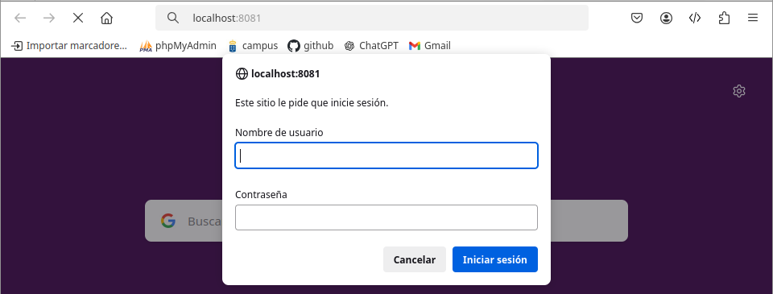
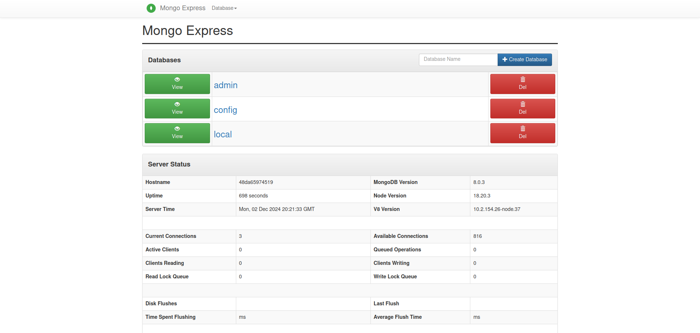
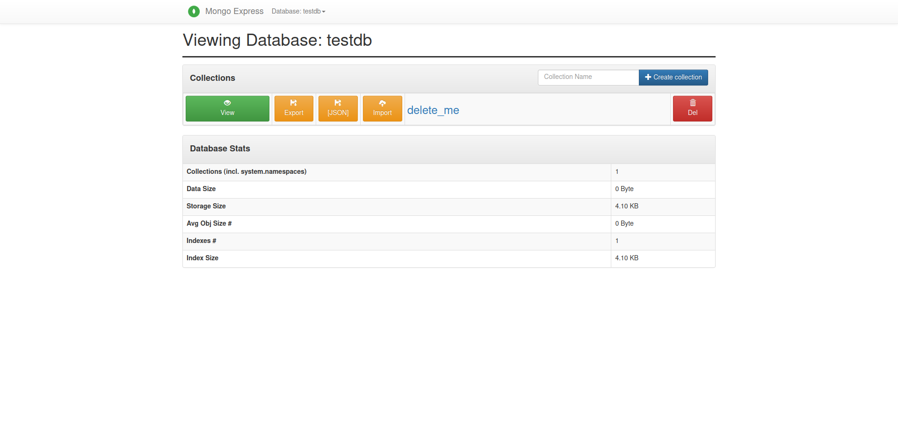
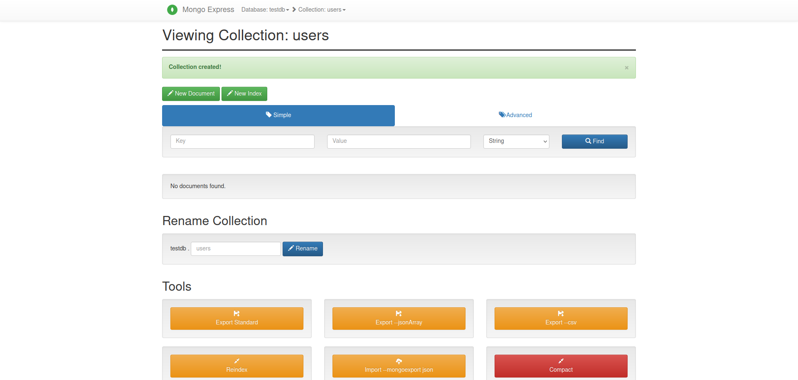
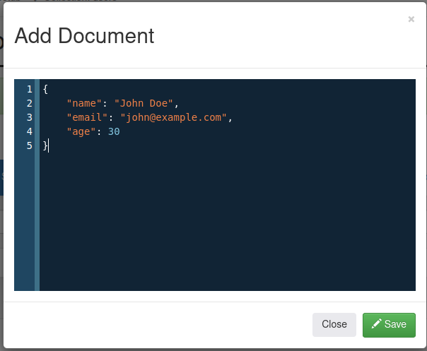
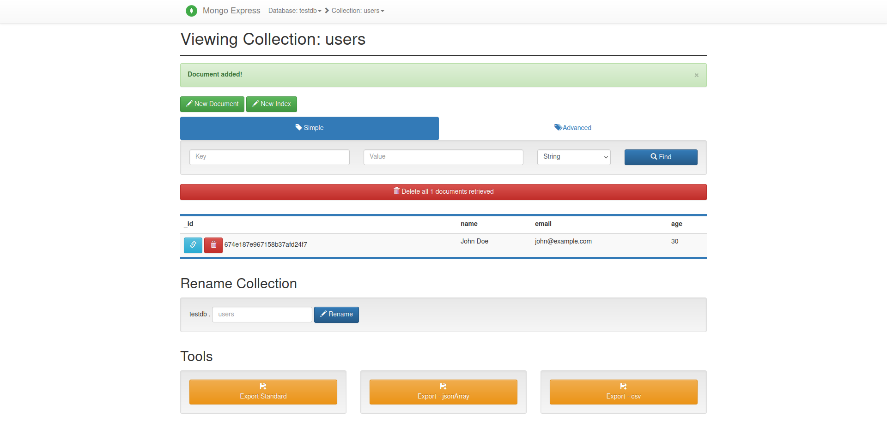

## Tarea 6
> [!TIP]
> docker network ls

Lista las redes que van a usar tus contenedores Docker.
```bash
NETWORK ID     NAME             DRIVER    SCOPE
f919cc783701   bridge           bridge    local
c701978f7a3f   host             host      local
b07fc71362dd   none             null      local
5731ac2c4f26   tomcat-network   bridge    local
```
---
### Crear una red personalizada
> [!TIP]
> docker network create mongodb-network

Creamos una nueva red de Docker llamada **mongodb-network**.
```bash
1dcbe7c3aa65ab0c03e9f374e5a5e3d70a67b459a502cc42093ad1d6c281bf81
```
---
### Crear un volumen para MongoDB
> [!TIP]
> docker volume create mongodb-data

Creamos un volumen llamado mongodb-data
```bash
mongodb-data
```
---
> [!TIP]
> docker volume ls

Listamos los volúmenes creados
```bash
DRIVER    VOLUME NAME
local     mongodb-data
```
---
### Levantar el contenedor MongoDB
> [!TIP]
> docker run -d --name mongodb-container \
> --network mongodb-network \
> -e MONGO_INITDB_ROOT_USERNAME=admin \
> -e MONGO_INITDB_ROOT_PASSWORD=admin123 \
> -v mongodb-data:/data/db \
> -p 27017:27017 \
> mongo:latest

Creamos un contenedor con lo siguiente:
- red: mongodb-network
- variables: 
  - usuario: admin
  - contraseña: admin123
```bash
Unable to find image 'mongo:latest' locally
latest: Pulling from library/mongo
afad30e59d72: Pull complete 
2ab913c649fa: Pull complete 
142bff30356f: Pull complete 
ea6a78a8bfa5: Pull complete 
e87de320d14a: Pull complete 
e8fb995504bd: Pull complete 
edbe36f78898: Pull complete 
1f774f57f04f: Pull complete 
Digest: sha256:c165af1a407eefce644877bf5a59ba3d9ca762e62b4f1723c919dc08dc32f4d0
Status: Downloaded newer image for mongo:latest
48da659745194445374b3acade656f332f182f404a31b668a8a965b415859562
```
---
### Levantar el Contenedor Mongo Express
> [!TIP]
> docker run -d --name mongo-express-container \
> --network mongodb-network \
> -e ME_CONFIG_MONGODB_ADMINUSERNAME=admin \
> -e ME_CONFIG_MONGODB_ADMINPASSWORD=admin123 \
> -e ME_CONFIG_MONGODB_SERVER=mongodb-container \
> -p 8081:8081 \
> mongo-express:latest

creamos un contenedor de mongo con express
```bash
Unable to find image 'mongo-express:latest' locally
latest: Pulling from library/mongo-express
619be1103602: Pull complete 
7e9a007eb24b: Pull complete 
5189255e31c8: Pull complete 
88f4f8a6bc8d: Pull complete 
d8305ae32c95: Pull complete 
45b24ec126f9: Pull complete 
9f7f59574f7d: Pull complete 
0bf3571b6cd7: Pull complete 
Digest: sha256:1b23d7976f0210dbec74045c209e52fbb26d29b2e873d6c6fa3d3f0ae32c2a64
Status: Downloaded newer image for mongo-express:latest
e505867f04032b8eb2563c77cad8bfe6b39b88bb1272317fae95983a757484bc
```
---
### Verificar los contenedores activos
> [!TIP]
> docker ps

```bash
CONTAINER ID   IMAGE                  COMMAND                  CREATED         STATUS         PORTS                                           NAMES
e505867f0403   mongo-express:latest   "/sbin/tini -- /dock…"   2 minutes ago   Up 2 minutes   0.0.0.0:8081->8081/tcp, :::8081->8081/tcp       mongo-express-container
48da65974519   mongo:latest           "docker-entrypoint.s…"   6 minutes ago   Up 6 minutes   0.0.0.0:27017->27017/tcp, :::27017->27017/tcp   mongodb-container
```
---
### Vemos los logs del contenedor de mongo express
> [!TIP]
> docker logs mongo-express-container

```bash
Mongo Express server listening at http://0.0.0.0:8081
```

> localhost:8081

Accedemos al cliente mongo express
- Usuario: admin
- Contraseña: pass







